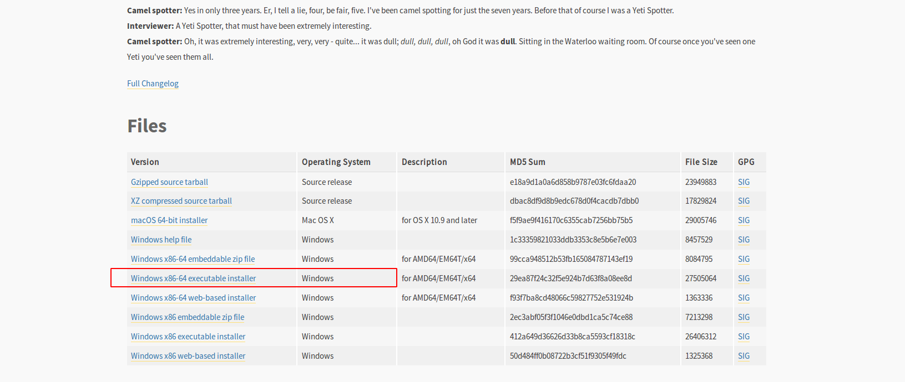

# Python Tutorials

## Python Installation

### Windows installation :

1. Please follow the instructions in the following blog.

[https://phoenixnap.com/kb/how-to-install-python-3-windows](https://phoenixnap.com/kb/how-to-install-python-3-windows)

2. There are steps to download the latest python binary in the blog, for downloading please go to the following link instead:

[https://www.python.org/downloads/release/python-380/](https://www.python.org/downloads/release/python-380/)

3. Then please download the following file:



4. Direct Link :  [https://www.python.org/ftp/python/3.8.0/python-3.8.0-amd64.exe](https://www.python.org/ftp/python/3.8.0/python-3.8.0-amd64.exe) 

### Linux installation : 

1. Please follow the instructions in the following blog.
2. [https://linuxize.com/post/how-to-install-python-3-8-on-ubuntu-18-04/](https://linuxize.com/post/how-to-install-python-3-8-on-ubuntu-18-04/)
3. After this please  add the following lines to ~/.bashrc
    ```
    $ alias python38="python3.8"
    $ alias pip38="python3.8 -m pip "
    ```
4. Then run the following commands on your terminal
    ```
    $ source ~/.bashrc
    $ pip38 install jupyter virtualenv
    ```
5. Optional: In-case it says module pip not found
    1. Try running
        ```
        $ sudo apt install python3.8-distutils
        ```
    2. Try running step 4 again. If you still face problems, run the following commands
        ```
        $ sudo dpkg --install --force all /var/cache/apt/archives/python3.8-lib2to3_3.8.0-1+bionic2_all.deb
        $ sudo dpkg --install --force all /var/cache/apt/archives/python3.8-distutils_3.8.0-1+bionic2_all.deb
        ```


## IDE Installation

### Jupyter

#### linux

```
$ pip38 install jupyter
```

#### windows

```
$ python3 -m pip install --upgrade pip
$ python3 -m pip install jupyter
```


### Starting Jupyter

```
$ jupyter notebook
```


### PyCharm

Download and install from

[https://www.jetbrains.com/pycharm/download/#section=linux](https://www.jetbrains.com/pycharm/download/#section=linux)

### Favorite Text Editor

Sublime, Notepad++, Atom, Vim, Nano ,Emacs, Visual Studio Code, Notepad… 

## Intro

### Python Use Cases

* Python can be used on a server to create web applications.

* Python can be used alongside software to create workflows.

* Python can connect to database systems. It can also read and modify files.

* Python can be used to handle big data and perform complex mathematics.

* Python can be used for rapid prototyping, or for production-ready software development.

### How to write python

* Python was designed for readability, and has some similarities to the English language with influence from mathematics.

* Python uses new lines to complete a command, as opposed to other programming languages which often use semicolons or parentheses.

* Python relies on indentation, using whitespace, to define scope; such as the scope of loops, functions and classes. Other programming languages often use curly-brackets for this purpose.

### Create your first python code

1. helloworld.py

2. python

3. ipython

4. jupyter notebook

### Indentation

### Variables

### Comments

### pep8

[https://www.python.org/dev/peps/pep-0008/](https://www.python.org/dev/peps/pep-0008/) 